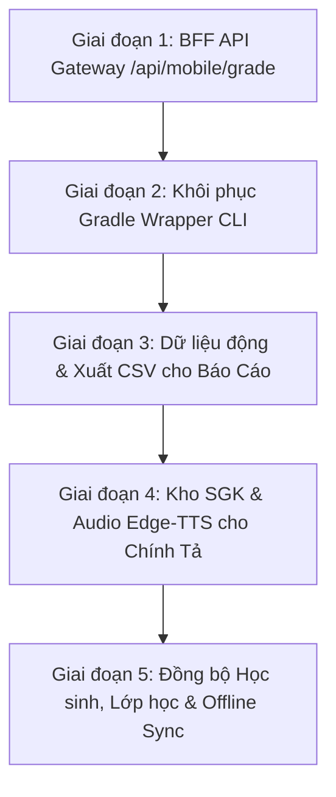

# 📑 KẾ HOẠCH HOÀN THIỆN TOÀN DIỆN DỰ ÁN ANDROID APP (VIHAND GRADE NATIVE)

> **Mục tiêu**: Hướng dẫn chi tiết từng bước (Step-by-Step Action Plan) để AI Agent hoặc Lập trình viên bám sát và triển khai, đưa ứng dụng di động **ViHand Grade Native** ([`android_app`](./)) đạt trạng thái hoàn thiện 100%, sẵn sàng thi đấu Giải thưởng NCKH Euréka và đưa vào ứng dụng thực tế.

---

## 📌 1. BẢNG PHÂN TÍCH HIỆN TRẠNG & ĐIỂM NGHẼN KỸ THUẬT

| Hạng mục | Trạng thái hiện tại | Vấn đề / Điểm nghẽn kỹ thuật | Mức độ ưu tiên |
|---|---|---|---|
| **AI Grading API** | Gọi `POST /api/grade` | Thiếu `studentText` $\rightarrow$ Server trả 400 $\rightarrow$ App luôn fallback vào Mock Data | 🔴 **P0 (Khẩn cấp)** |
| **Gradle CLI Build** | Thiếu `gradlew.bat` / `gradlew` | Không thể build APK dòng lệnh (`.\gradlew.bat assembleDebug` báo lỗi không tìm thấy) | 🟠 **P1 (Cao)** |
| **Báo cáo Thống kê** | UI đẹp trên `ReportsAnalyticsScreen` | Dữ liệu thống kê hardcoded tĩnh; Nút xuất Excel/CSV chưa sinh file thật | 🟡 **P2 (Trung bình)** |
| **Đọc Chính tả AI** | 1 bài thơ mẫu trên `DictationScreen` | Chưa có bộ lọc SGK Lớp 1–5; Chưa stream Edge-TTS từ server | 🟡 **P2 (Trung bình)** |
| **Đồng bộ Lớp/Học sinh** | Hardcoded trong `CameraScanScreen` | Chưa fetch từ `/api/classes` & `/api/users`; Chưa có nút sync offline grades lên Server | 🟢 **P3 (Tiêu chuẩn)** |

---

## 🗺️ 2. LỘ TRÌNH 5 GIAI ĐOẠN THỰC THI (ROADMAP)



---

## 🚀 GIAI ĐOẠN 1: XÂY DỰNG BFF API GATEWAY CHẤM BÀI DI ĐỘNG (P0 - CỐT LÕI)

### 1.1 Bối cảnh bài toán
Ứng dụng Android chụp ảnh chỉ truyền chuỗi `imageBase64`. Backend Next.js hiện tại tách thành 2 route độc lập:
1. `/api/ocr` (nhận ảnh $\rightarrow$ trả về text)
2. `/api/grade` (nhận text $\rightarrow$ trả về điểm số).
Do Android hiện gọi thẳng `/api/grade` mà không gửi kèm `studentText`, server Next.js luôn trả lỗi `HTTP 400: Cần cung cấp văn bản học sinh (studentText)`. Do đó, ứng dụng Android luôn rơi vào khối `catch` và hiển thị kết quả giả lập từ hàm `generateSimulatedAnalysis`.

### 1.2 Nhiệm vụ thực hiện
Tạo endpoint chuyên dụng cho thiết bị di động theo đúng mục 5.1 của `TECHNICAL_SPECIFICATION.md`: **`POST /api/mobile/grade`**.

#### Bước 1.1: Tạo Route Backend `Web_sua_loi/app/api/mobile/grade/route.ts`
- **Request Body nhận vào**:
  ```json
  {
    "imageBase64": "data:image/jpeg;base64,...",
    "studentGrade": 3,
    "gradingMode": "dictation",
    "studentName": "Nguyễn Bảo Nam",
    "className": "Lớp 3A1",
    "the_loai": "tho",
    "hinh_thuc": 3.0,
    "noi_dung": 2.0,
    "penalty_per_error": 0.5
  }
  ```
- **Xử lý trọn gói trong 1 request**:
  1. *Tiền xử lý ảnh (Tùy chọn)*: Sử dụng hàm trong `lib/image-processor.ts` nếu cần khử bóng/cân bằng trắng.
  2. *Vision OCR*: Gọi Gemini 3.1 Flash Lite với prompt OCR chuyên dụng (tái sử dụng từ `app/api/ocr/route.ts`) để bóc tách:
     - `original_text`: Chữ viết tay thực tế của học sinh (giữ nguyên lỗi).
     - `gemini_fixed_text`: Văn bản đã sửa chuẩn chính tả và viết hoa.
     - `the_loai`: `"tho"` hoặc `"van_xuoi"`.
  3. *Bounding Box*: Gọi song song dịch vụ YOLOv8 (`detectYoloBoxes(imageBase64)`).
  4. *Thuật toán Chấm điểm*:
     - Chạy `gradeWithLevenshtein(original_text, gemini_fixed_text, scoreConfig, yoloData)`.
     - Phân loại 6 nhóm lỗi: `viet_hoa`, `phu_am_dau`, `van`, `dau_thanh`, `bo_sot_them`, `dau_cau`.
     - Tính điểm Barem 10 theo tiêu chí: Chính tả (4đ hoặc 7đ) + Hình thức (3đ) + Nội dung (2đ) + Sáng tạo (1đ).
  5. *Nhận xét Sư phạm*: Gọi Qwen SLM (hoặc prompt Gemini fallback) sinh 3 gợi ý nhận xét sư phạm giàu tính khích lệ (`pedagogicalComments`).
  6. *Trả về JSON response* tương thích 100% với `GradeApiResponse` của Android (chứa `criteria`, `errors` với tọa độ `rel_x1, rel_y1, rel_w, rel_h`, `extractedText`, `correctedFullText`, `pedagogicalComment`).

#### Bước 1.2: Cập nhật Android Client
- **File**: [`app/src/main/java/com/example/data/api/GradeApiService.kt`](./app/src/main/java/com/example/data/api/GradeApiService.kt)
  - Cập nhật URL: `@POST("api/mobile/grade")` thay cho `@POST("api/grade")`.
- **File**: [`app/src/main/java/com/example/data/api/GradeApiModels.kt`](./app/src/main/java/com/example/data/api/GradeApiModels.kt)
  - Thêm các trường `studentName`, `className`, `gradingMode` vào `GradeApiRequest`.
- **File**: [`app/src/main/java/com/example/data/repository/GradeRepository.kt`](./app/src/main/java/com/example/data/repository/GradeRepository.kt)
  - Truyền các tham số trên từ giao diện xuống request API.
  - Đảm bảo ánh xạ chính xác các trường tọa độ Bounding Box tương đối (`rel_x1, rel_y1, rel_w, rel_h`) vào model `ErrorBox`.

---

## 📦 GIAI ĐOẠN 2: KHÔI PHỤC BỘ THỰC THI GRADLE WRAPPER CLI (P1)

### 2.1 Bối cảnh bài toán
Thư mục `android_app` hiện chỉ có `gradle/wrapper/gradle-wrapper.properties` mà thiếu file thực thi `gradlew.bat` (Windows), `gradlew` (Linux/Mac) và file thư viện `gradle-wrapper.jar`. Do đó, lệnh `.\gradlew.bat assembleDebug` không thể chạy trực tiếp từ dòng lệnh.

### 2.2 Nhiệm vụ thực hiện
1. Khôi phục hoặc tạo bộ wrapper hoàn chỉnh tương thích với Gradle 8.11 / 9.0:
   - `android_app/gradlew.bat`
   - `android_app/gradlew`
   - `android_app/gradle/wrapper/gradle-wrapper.jar`
2. Kiểm tra lệnh phiên bản:
   ```powershell
   cmd /c "cd /d c:\Users\Jackie Duong\Desktop\Web_sua_loi\android_app && gradlew.bat --version"
   ```
3. Xác nhận biên dịch thành công file APK mẫu:
   ```powershell
   cmd /c "cd /d c:\Users\Jackie Duong\Desktop\Web_sua_loi\android_app && gradlew.bat assembleDebug"
   ```

---

## 📊 GIAI ĐOẠN 3: KẾT NỐI DỮ LIỆU ĐỘNG CHO MÀN HÌNH BÁO CÁO (P2)

### 3.1 Bối cảnh bài toán
Màn hình [`ReportsAnalyticsScreen.kt`](./app/src/main/java/com/example/ui/screens/ReportsAnalyticsScreen.kt) đã có giao diện Material 3 rất đẹp mắt, nhưng hiện tại các danh sách lỗi và thống kê học sinh đều là danh sách tĩnh cố định (`listOf(ErrorCategoryStat(...))`), chưa phản ánh dữ liệu thực tế từ các bài đã chấm. Nút xuất Excel/CSV mới chỉ hiển thị thông báo giả lập.

### 3.2 Nhiệm vụ thực hiện
1. **Bổ sung truy vấn tổng hợp trong DAO**:
   - File: [`app/src/main/java/com/example/data/local/GradeRecordDao.kt`](./app/src/main/java/com/example/data/local/GradeRecordDao.kt)
   - Viết các câu lệnh lấy toàn bộ bài chấm theo lớp hoặc theo khoảng thời gian:
     ```kotlin
     @Query("SELECT * FROM grade_records ORDER BY timestamp DESC")
     fun getAllRecordsFlow(): Flow<List<GradeRecordEntity>>
     ```
2. **Xử lý thống kê trong ViewModel**:
   - File: [`app/src/main/java/com/example/ui/viewmodel/MainViewModel.kt`](./app/src/main/java/com/example/ui/viewmodel/MainViewModel.kt)
   - Đọc danh sách `historyRecords` $\rightarrow$ giải mã chuỗi `errorsJson` của từng bài:
     - Thống kê tổng số lỗi theo 6 loại: Phụ âm đầu, Vần, Dấu thanh, Viết hoa, Bỏ sót/Thêm chữ, Dấu câu.
     - Tính tỷ lệ phần trăm từng dạng lỗi để vẽ biểu đồ thanh tiến trình.
     - Lọc danh sách các học sinh có điểm trung bình < 7.0 để đưa vào danh sách *"Học sinh cần kèm cặp"*.
3. **Kết nối dữ liệu vào `ReportsAnalyticsScreen.kt`**:
   - Nhận state thống kê từ `MainViewModel`.
   - **Xây dựng tính năng Xuất File CSV Thật**:
     - Tạo hàm `exportGradesToCsv(context, records): Uri` xuất nội dung gồm: STT, Họ tên học sinh, Lớp, Tiêu đề bài, Tổng điểm, Điểm chính tả, Điểm hình thức, Lỗi phổ biến, Ngày chấm.
     - Lưu file tại `context.cacheDir/vihand_grade_report.csv`.
     - Dùng `FileProvider` mở `Intent(Intent.ACTION_SEND)` để giáo viên có thể gửi file trực tiếp qua Zalo, Email, hoặc lưu vào Google Drive.

---

## 🎙️ GIAI ĐOẠN 4: ĐỘNG HÓA KHO BÀI ĐỌC SGK & AUDIO EDGE-TTS (P2)

### 4.1 Bối cảnh bài toán
Màn hình [`DictationScreen.kt`](./app/src/main/java/com/example/ui/screens/DictationScreen.kt) hiện chỉ có duy nhất 1 bài đọc ("Quạt cho bà ngủ") và phát âm bằng `android.speech.tts.TextToSpeech` mặc định của thiết bị (chất lượng giọng tiếng Việt khá cứng).

### 4.2 Nhiệm vụ thực hiện
1. **Tích hợp API tải kho bài đọc**:
   - Thêm vào [`GradeApiService.kt`](./app/src/main/java/com/example/data/api/GradeApiService.kt):
     ```kotlin
     @GET("api/dictation/passages")
     suspend fun getDictationPassages(): Response<List<DictationPassageModel>>
     ```
2. **Kho bài đọc dự phòng ngoại tuyến (Offline Asset)**:
   - Tạo file `LocalDictationPassages.kt` chứa sẵn danh sách bài đọc mẫu của các bộ sách (Cánh Diều, Kết Nối Tri Thức, Chân Trời Sáng Tạo) cho Lớp 1 đến Lớp 5.
3. **Nâng cấp UI `DictationScreen.kt`**:
   - Thêm bộ lọc Dropdown: Khối Lớp (1-5) $\rightarrow$ Bài học theo tuần.
   - Thêm tùy chọn giọng đọc: Cô Hoài My (Nữ miền Bắc) / Thầy Nam Minh (Nam miền Bắc).
   - Tích hợp `android.media.MediaPlayer` để stream âm thanh MP3 trực tiếp từ endpoint Next.js `/api/dictation/tts?text=...&voice=...`.
   - Nếu mất kết nối mạng, ứng dụng tự động chuyển về bộ phát âm ngoại tuyến `TextToSpeech` mà không làm gián đoạn bài học.

---

## 🔄 GIAI ĐOẠN 5: ĐỒNG BỘ HỌC SINH, LỚP HỌC & SỔ ĐIỂM TRUNG TÂM (P3)

### 5.1 Bối cảnh bài toán
Giáo viên hiện phải chọn danh sách học sinh mẫu được gán cứng trong `CameraScanScreen.kt`. Khi chấm xong, kết quả chỉ lưu trên Room SQLite của máy điện thoại cá nhân, chưa được đồng bộ vào cơ sở dữ liệu trung tâm của trường học (`prisma/vihand.db`).

### 5.2 Nhiệm vụ thực hiện
1. **API đồng bộ**:
   - Trong `GradeApiService.kt`:
     - `@GET("api/classes") suspend fun getClasses(): Response<List<ClassDto>>`
     - `@GET("api/users?role=student") suspend fun getStudents(): Response<List<StudentDto>>`
     - `@POST("api/grades") suspend fun syncGradeToServer(@Body request: ServerGradeSyncRequest): Response<Map<String, Any>>`
2. **Bộ chọn học sinh động (`CameraScanScreen.kt`)**:
   - Dropdown Lớp và Tên học sinh hiển thị danh sách lớp thực tế của giáo viên.
3. **Nút Đồng bộ Sổ Điểm Offline (`ServerSettingsScreen.kt`)**:
   - Thêm card quản lý đồng bộ:
     - Hiển thị số lượng bài chấm đã lưu cục bộ trên máy.
     - Nút *"Đồng bộ lên máy chủ"* $\rightarrow$ duyệt qua các bản ghi trong Room DB và đẩy lên server `/api/grades`.
     - Cập nhật cờ `isSynced = true` sau khi đồng bộ thành công.

---

## 🧪 3. CHECKLIST KIỂM THỬ VÀ NGHIỆM THU (VERIFICATION CHECKLIST)

- [ ] **Test Case 1 (API Thật)**: Chụp 1 trang vở ô ly thật trên điện thoại $\rightarrow$ gửi lên server qua `POST /api/mobile/grade` $\rightarrow$ trả về kết quả trong < 8 giây $\rightarrow$ KHÔNG rơi vào `generateSimulatedAnalysis`.
- [ ] **Test Case 2 (Bounding Box)**: Màn hình `GradingResultScreen` hiển thị các khung chữ nhật đỏ đúng từng chữ sai $\rightarrow$ chạm ngón tay vào khung mở popup giải thích lỗi sư phạm.
- [ ] **Test Case 3 (Offline Mode)**: Bật chế độ máy bay $\rightarrow$ ứng dụng vẫn cho phép chụp, chấm điểm mô phỏng và lưu vào Room DB an toàn, không bị crash.
- [ ] **Test Case 4 (Báo cáo Thống kê)**: Màn hình `ReportsAnalyticsScreen` phản ánh đúng số bài đã chấm trong Lịch sử và xuất được file `.csv` chia sẻ qua Zalo.
- [ ] **Test Case 5 (Build APK)**: Chạy `.\gradlew.bat assembleDebug` trên PowerShell tạo ra file `app-debug.apk` không có lỗi lint hay syntax.
