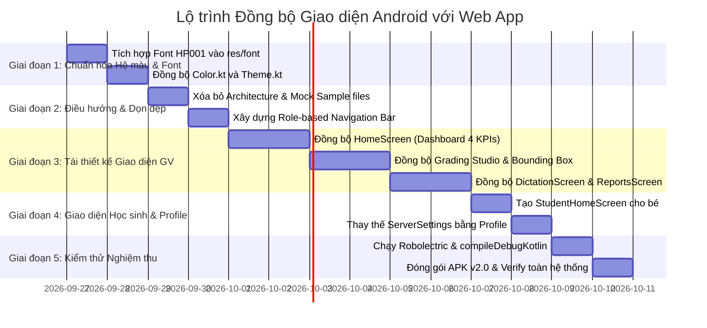

# 📋 KẾ HOẠCH ĐỒNG BỘ TOÀN DIỆN GIAO DIỆN & TÍNH NĂNG ANDROID APP VỚI WEB APP
## Hệ sinh thái Trợ lý Chấm điểm & Rèn chữ Tiểu học ViHand Grade

> **Tài liệu quy hoạch kỹ thuật & giao diện người dùng (UI/UX Synchronization Blueprint)**  
> **Áp dụng cho thư mục:** `android_app/`  
> **Phiên bản đồng bộ:** v2.0-aligned (Chuẩn hóa 1:1 theo Web App Next.js)  
> **Ngày lập:** 26/09/2026

---

## 🎯 1. TỔNG QUAN & TÔN CHỈ THIẾT KẾ (EXECUTIVE SUMMARY)

### 1.1. Hiện trạng & Vấn đề tồn đọng
Hiện tại, phiên bản **Android App** có sự phân hóa đáng kể so với **Web App** (`https://vihandgrade.click`):
1. **Lệch hệ màu nhận diện:** Web App sử dụng tông màu Sư phạm Tiểu học ấm áp, nền sáng nhẹ (`oklch(0.98 0.005 90)` / `#FAF9F6`), màu chủ đạo xanh ngọc Emerald dịu mắt (`#059669` / `#0D9488`), hệ thẻ viền bo mềm `12px - 16px`. Ngược lại, Android App đang lạm dụng nền xám đen Slate gắt, nhiều mã màu xanh neon rực rỡ không đồng nhất.
2. **Tồn tại nhiều tính năng "rác" / debug kỹ thuật không hề có trên Web:**
   - Cài đặt SSH Raspberry Pi, ping Cloudflare Tunnel, cấu hình port mạng nội bộ.
   - Sơ đồ kiến trúc phần cứng YOLOv8 + ViT5 (`ArchitectureDiagram.kt`).
   - Nút chấm bài mẫu giả lập (Sample Essays Mock), nút reset database offline, v.v.
   Mọi tính năng này làm rối mắt người dùng thực tế (Giáo viên và Phụ huynh/Học sinh).
3. **Chưa đồng bộ phân quyền giao diện (Role-based Navigation):**
   - Web App tách biệt rõ rệt luồng trải nghiệm của **Giáo viên** (Tổng quan $\to$ Chấm điểm $\to$ Đọc chính tả $\to$ Báo cáo lớp) và **Học sinh** (Góc học tập $\to$ Sổ điểm & Bài chấm).
   - Android App hiện tại dùng một thanh Bottom Navigation cố định 5 nút cho tất cả mọi người, thiếu tính chuyên biệt.

### 1.2. Mục tiêu cốt lõi của Kế hoạch này
- **Đồng bộ 100% bản sắc thị giác (Visual Identity):** Chuyển toàn bộ Theme Compose sang bảng mã màu chuẩn của Web App (Emerald Green, Soft Cream Background, 6 mã màu phân loại lỗi Thông tư 27).
- **Thanh lọc triệt để (Zero Redundant Features):** Loại bỏ hoàn toàn các màn hình, dialog, thành phần mockup kỹ thuật không có trên Web.
- **Ánh xạ 1:1 các phân hệ tính năng (Feature Parity):**
  - **Giáo viên:** 4 phân hệ chuẩn: `Tổng quan` | `Chấm điểm` | `Đọc chính tả` | `Báo cáo lớp`.
  - **Học sinh:** 2 phân hệ chuẩn: `Góc học tập` | `Sổ điểm & Bài làm`.
- **Tích hợp Font chữ Tiểu học Chuẩn Bộ GD&ĐT (HP001):** Đưa bộ font ô ly tiểu học vào Android App để hiển thị bài chép chính tả và bài sửa của học sinh y hệt trên Web.

---

## 🔍 2. MA TRẬN ĐỐI CHIẾU & PHÂN LOẠI TÍNH NĂNG (AUDIT MATRIX)

### 2.1. Bảng phân loại: GIỮ LẠI - LOẠI BỎ - ĐỒNG BỘ MỚI

| Thành phần trên Android | Trạng thái trên Web | Quyết định xử lý trên Android App | Ghi chú & Hành động cụ thể |
|---|---|:---:|---|
| **Sơ đồ kiến trúc phần cứng (`ArchitectureDiagram.kt`, `ArchitectureInfoDialog.kt`)** | ❌ KHÔNG CÓ | 🗑️ **XÓA BỎ HOÀN TOÀN** | Web chỉ dành cho giáo viên/học sinh sử dụng sư phạm, không trưng bày sơ đồ kỹ thuật YOLO/Pi. |
| **Cài đặt kỹ thuật Server (`ServerSettingsScreen.kt`, SSH Pi, Ping Tunnel)** | ❌ KHÔNG CÓ | 🗑️ **XÓA BỎ / THAY THẾ** | Thay bằng màn hình **Tài khoản & Cài đặt (`ProfileSettingsScreen.kt`)** đơn giản: Xem tên GV, trường lớp, đổi Theme sáng/tối, nút Đăng xuất. Server URL gán mặc định ngầm `https://vihandgrade.click/`. |
| **Mock Sample Essays (`SampleEssays.kt`, các nút bài mẫu demo)** | ❌ KHÔNG CÓ | 🗑️ **XÓA BỎ KHỎI UI CHÍNH** | Giáo viên chỉ chụp ảnh bài thi thật bằng Camera hoặc chọn ảnh từ máy để chấm. |
| **Nút "Chấm Offline 🧪" & Giả lập lỗi** | ❌ KHÔNG CÓ | 🗑️ **XÓA BỎ** | Xử lý lỗi kết nối thân thiện giống Web (thông báo Toast/Banner kết nối, không đưa nút giả lập). |
| **Thanh Bottom Nav 5 nút cố định** | Khác biệt | 🔄 **TÁI CẤU TRÚC ĐỘNG** | Đổi thành Bottom Nav động theo vai trò đăng nhập (`teacher` vs `student`). |
| **Màn hình Đăng nhập ([LoginScreen.kt])** | Có (`/`) | 🔄 **ĐỒNG BỘ 1:1** | Thêm 2 Tab chuyển vai trò: **Giáo viên** / **Học sinh**, ô nhập tài khoản bo cong 12dp màu Emerald dịu nhẹ. |
| **Màn hình Tổng quan ([HomeScreen.kt])** | Có (`/teacher`) | 🔄 **ĐỒNG BỘ 1:1** | Bỏ mock list, hiển thị đúng 4 Thẻ chỉ số: *Tổng bài đã chấm*, *Học sinh*, *Điểm TB*, *Đề bài* + 5 bài chấm gần nhất. |
| **Studio Chấm điểm ([GradingResultScreen.kt])** | Có (`/teacher/grade`) | 🔄 **ĐỒNG BỘ 1:1** | Chuẩn hóa 6 màu Bounding Box theo `ERROR_THEMES`, bảng điểm 4 tiêu chí Thông tư 27, Diff Viewer với font chữ tiểu học HP001. |
| **Đọc chính tả ([DictationScreen.kt])** | Có (`/teacher/dictation`) | 🔄 **ĐỒNG BỘ 1:1** | Bộ lọc Khối lớp (1-5) & Bộ sách (Cánh Diều, Kết Nối Tri Thức, Chân Trời Sáng Tạo), tích hợp TTS đọc chính tả chậm rèn chữ. |
| **Báo cáo lớp ([ReportsAnalyticsScreen.kt])** | Có (`/teacher/reports`) | 🔄 **ĐỒNG BỘ 1:1** | Tải dữ liệu thật từ `/api/grades`, biểu đồ phân bố điểm, tìm kiếm học sinh, xem chi tiết bài chấm. |
| **Góc học tập cho Bé & Phụ huynh** | Có (`/student`) | ✨ **TẠO MỚI CHO MOBILE** | Giao diện động viên học sinh: Điểm mới nhất, Lời khen cô giáo, Sổ tay các từ khó hay sai để bé luyện lại. |

---

## 🎨 3. QUY CHUẨN THIẾT KẾ & HỆ THỐNG MÀU SẮC (DESIGN SYSTEM ALIGNMENT)

Toàn bộ hệ thống màu trong `android_app/app/src/main/java/com/example/ui/theme/Color.kt` và `Theme.kt` sẽ được đồng bộ chính xác với `app/globals.css` của Web.

### 3.1. Bảng màu Nền tảng (Brand & Foundation Palette)

| Token UI | Mã Màu Web (`globals.css`) | Mã Hex tương đương (Compose) | Ứng dụng trên Android |
|---|---|---|---|
| **Primary (Chủ đạo)** | `oklch(0.55 0.15 160)` | `Color(0xFF059669)` / `Color(0xFF0D9488)` | Nút hành động chính, tab đang chọn, icon nổi bật |
| **Primary Dark Mode** | `oklch(0.65 0.18 160)` | `Color(0xFF10B981)` / `Color(0xFF34D399)` | Màu chủ đạo khi bật Dark Theme |
| **Background (Light)** | `oklch(0.98 0.005 90)` | `Color(0xFFFAF9F6)` | Nền toàn bộ ứng dụng (ấm áp như giấy học sinh) |
| **Background (Dark)** | `oklch(0.14 0.02 260)` | `Color(0xFF141724)` | Nền chế độ tối dịu mắt (không dùng đen tuyền) |
| **Card / Surface (Light)** | `oklch(1 0 0)` | `Color(0xFFFFFFFF)` | Bề mặt thẻ Card, Dialog, Bottom Navigation |
| **Card / Surface (Dark)** | `oklch(0.18 0.02 260)` | `Color(0xFF1E2235)` | Thẻ Card chế độ tối |
| **Border / Phân cách (Light)** | `oklch(0.90 0.01 90)` | `Color(0xFFE2E8F0)` | Viền thẻ, đường kẻ phân chia danh mục |
| **Border / Phân cách (Dark)** | `oklch(0.28 0.02 260)` | `Color(0xFF2D334A)` | Viền thẻ trong Dark Theme |
| **Text Primary (Light)** | `oklch(0.25 0.02 260)` | `Color(0xFF0F172A)` | Tiêu đề chính, văn bản bài đọc |
| **Text Muted (Light)** | `oklch(0.50 0.02 260)` | `Color(0xFF64748B)` | Chú thích phụ, ngày giờ, đơn vị đo |

### 3.2. Bảng 6 Mã Màu Lỗi Chính Tả Chuẩn Bộ GD&ĐT (`ERROR_THEMES`)
Trên màn hình xem bài chấm ([PhotoBoundingBoxViewer.kt]), các hộp khoanh lỗi Bounding Box và Badge thông tin phải tuân thủ chuẩn 100% của Web:

```kotlin
// Bảng màu 6 loại lỗi đồng bộ với ERROR_THEMES trên Web
val ErrorThemePhuAmDau  = Color(0xFFF43F5E) // Rose-500 (Phụ âm đầu tr/ch, s/x, r/d/gi)
val ErrorThemeDauThanh   = Color(0xFFA855F7) // Purple-500 (Dấu thanh Hỏi/Ngã, Sắc/Nặng)
val ErrorThemeVan        = Color(0xFFF97316) // Orange-500 (Vần an/ang, en/eng)
val ErrorThemeAmChinh    = Color(0xFF10B981) // Emerald-500 (Nguyên âm o/ô, u/ư)
val ErrorThemePhuAmCuoi  = Color(0xFF0EA5E9) // Sky-500 (Âm cuối t/c, n/ng)
val ErrorThemeVietHoa    = Color(0xFFF59E0B) // Amber-500 (Viết hoa đầu câu, danh từ riêng)
```

### 3.3. Bảng Màu Xếp Loại Điểm Số (Theo Thông tư 27)

```kotlin
fun getScoreColor(score: Float): Color = when {
    score >= 9.0f -> Color(0xFF059669) // Xuất sắc (Emerald)
    score >= 7.0f -> Color(0xFF0284C7) // Hoàn thành tốt (Sky)
    score >= 5.0f -> Color(0xFFD97706) // Hoàn thành (Amber)
    else          -> Color(0xFFDC2626) // Cần cố gắng (Rose/Red)
}
```

### 3.4. Tích hợp Font chữ Tiểu học Ô ly HP001
- Tận dụng 7 file font có sẵn tại `Font Tieu hoc/fONT TIEU HOC/`:
  - `HP001_4_hang_normal.ttf` $\to$ Đặt vào `android_app/app/src/main/res/font/hp001_normal.ttf`.
  - `HP001_4_hang_bold.ttf` $\to$ Đặt vào `android_app/app/src/main/res/font/hp001_bold.ttf`.
- Định nghĩa trong `Type.kt`:
  ```kotlin
  val FontFamilyTieuHoc = FontFamily(
      Font(R.font.hp001_normal, FontWeight.Normal),
      Font(R.font.hp001_bold, FontWeight.Bold)
  )
  ```
- Áp dụng vào phần so sánh văn bản học sinh (Diff Tab) để tạo cảm giác bài viết tay chuẩn mực tiểu học.

---

## 🏛️ 4. KIẾN TRÚC ĐIỀU HƯỚNG PHÂN QUYỀN (ROLE-BASED NAVIGATION)

### 4.1. Sơ đồ Luồng màn hình (Screen Flow Architecture)

```
                            ┌────────────────────────┐
                            │    Màn hình Đăng nhập  │
                            │    ([LoginScreen.kt])  │
                            └───────────┬────────────┘
                                        │
                    ┌───────────────────┴───────────────────┐
                    ▼                                       ▼
     [VAI TRÒ: GIÁO VIÊN (teacher)]           [VAI TRÒ: HỌC SINH (student)]
     Bottom Navigation 4 Tabs:                Bottom Navigation 2 Tabs:
     1. 📊 Tổng quan (Dashboard)              1. 🌟 Góc học tập (StudentHome)
     2. 📸 Chấm điểm (Grading Studio)         2. 📖 Sổ điểm & Bài chấm (History)
     3. 🎙️ Đọc chính tả (Dictation)
     4. 📑 Báo cáo lớp (Reports)
                    │                                       │
                    └───────────────────┬───────────────────┘
                                        ▼
                         [Top App Bar Chung Cả 2 Vai Trò]
                         - Logo ViHand Grade + Tên trường/lớp
                         - Avatar & Tên người dùng
                         - Nút chuyển Theme Sáng/Tối
                         - Nút Đăng xuất an toàn
```

---

## 📱 5. KẾ HOẠCH TÁI CẤU TRÚC CHI TIẾT TỪNG MÀN HÌNH

### 5.1. Màn hình Đăng nhập ([LoginScreen.kt])
- **Mục tiêu:** Đồng bộ giao diện với trang chủ Web (`/`).
- **Thay đổi cụ thể:**
  - Thêm Tab chuyển đổi vai trò ngay đầu trang: **"Giáo viên"** và **"Học sinh & Phụ huynh"**.
  - Thiết kế Card đăng nhập màu trắng, đổ bóng mềm `elevation = 4.dp`, viền bo góc tròn `16.dp`.
  - Icon minh họa: Bút chì viết chữ mềm mại (`PenLine`) thay vì các icon công nghệ vuông vức.
  - Tự động lưu thông tin phiên làm việc vào `UserSessionManager` để chuyển hướng vào đúng luồng vai trò.

### 5.2. Màn hình Tổng quan Giáo viên ([HomeScreen.kt])
- **Mục tiêu:** Đồng bộ với trang `/teacher` trên Web.
- **Thay đổi cụ thể:**
  - **4 Thẻ Chỉ Số KPI (Dashboard Cards):**
    1. *Tổng bài đã chấm:* Số lượng bài, kèm icon `FileText`, nền xanh ngọc nhạt.
    2. *Học sinh đã chấm:* Số học sinh trong danh sách lớp, kèm icon `Users`.
    3. *Điểm trung bình:* Giá trị điểm số kèm badge màu theo Thông tư 27.
    4. *Số đề bài:* Số lượng bài tập/chính tả đã giao.
  - **Hero Action Card:** Nút to nổi bật *"Bắt đầu chấm điểm mới"* với nút chụp Camera nhanh dẫn thẳng vào Studio chấm bài.
  - **Danh sách 5 bài chấm mới nhất (Recent Graded):**
    - Hiển thị: Tên học sinh, Lớp học, Tên đề bài, Điểm số xếp loại (ví dụ: `9.0 Xuất sắc`), thời gian tương đối ("Hôm nay", "Hôm qua").
    - Nhấp vào bài bất kỳ $\to$ Mở ngay màn hình chi tiết bài làm.
  - **Loại bỏ:** Bỏ hoàn toàn khu vực "Sample Essays demo", bỏ danh sách chọn bài giả lập offline.

### 5.3. Màn hình Chấm điểm Studio ([CameraScanScreen.kt] & [GradingResultScreen.kt])
- **Mục tiêu:** Đồng bộ với trang `/teacher/grade` trên Web.
- **Thay đổi cụ thể:**
  - **Bước 1: Chuẩn bị chấm:**
    - Cho phép chọn Lớp học & Tên học sinh từ danh sách thực tế lấy qua API `/api/classes` và `/api/users`.
    - Hỗ trợ 2 phương thức nạp ảnh: Chụp trực tiếp qua Camera HOẶC Chọn ảnh bài làm có sẵn từ thư viện ảnh máy.
  - **Bước 2: Hiển thị kết quả chấm (3 Chế độ Tab mượt mà):**
    - **Tab 1 - Canvas Ảnh Bài Thi Thật:**
      - Ảnh bài thi được vẽ trực tiếp các hộp Bounding Box khoanh đúng tọa độ lỗi.
      - Màu viền hộp khoanh tuân thủ đúng 6 màu của `ERROR_THEMES`.
      - Khi nhấp vào hộp khoanh lỗi $\to$ Tự động cuộn và làm nổi bật Thẻ Chi Tiết Lỗi tương ứng bên dưới.
    - **Tab 2 - So sánh Văn bản (Diff Viewer):**
      - Đối chiếu 2 cột: Cột 1 là chữ học sinh viết (áp dụng font tiểu học HP001), Cột 2 là văn bản đã sửa đúng chính tả.
      - Các từ viết sai được gạch chân và tô màu cảnh báo trực quan.
    - **Tab 3 - Kỹ năng & Đánh giá Sư phạm:**
      - Bảng điểm 4 tiêu chí chuẩn Thông tư 27: *Chính tả (max 4đ)*, *Hình thức chữ viết (max 2đ)*, *Nội dung (max 2đ)*, *Sáng tạo (max 2đ)*.
      - Khung Lời nhận xét sư phạm ấm áp, khích lệ học sinh.
      - Nút **"Lưu vào Sổ điểm"** gửi dữ liệu đồng bộ lên máy chủ qua `POST /api/grades`.

### 5.4. Màn hình Đọc chính tả ([DictationScreen.kt])
- **Mục tiêu:** Đồng bộ với trang `/teacher/dictation` trên Web.
- **Thay đổi cụ thể:**
  - **Bộ lọc Ngữ liệu Chuẩn SGK:**
    - Chọn Khối lớp: Lớp 1, Lớp 2, Lớp 3, Lớp 4, Lớp 5.
    - Chọn Bộ sách: Cánh Diều, Kết Nối Tri Thức, Chân Trời Sáng Tạo.
    - Tải danh sách bài đọc từ `/api/dictation/passages`.
  - **Trình phát đọc chính tả (Dictation Player):**
    - Tích hợp giọng đọc TTS chuẩn Tiếng Việt.
    - Thanh điều chỉnh tốc độ đọc rèn chữ: 0.65x (Cực chậm - Lớp 1), 0.75x (Rất chậm), 0.85x (Chuẩn - Khuyên dùng), 1.0x (Bình thường).
    - Tùy chọn số lần lặp lại câu (1 lần, 2 lần, 3 lần).
    - Thời gian ngắt nghỉ giữa các cụm từ (5s, 7s, 10s) để học sinh kịp viết bài vào vở.

### 5.5. Màn hình Báo cáo lớp ([ReportsAnalyticsScreen.kt])
- **Mục tiêu:** Đồng bộ với trang `/teacher/reports` trên Web.
- **Thay đổi cụ thể:**
  - Lấy dữ liệu sổ điểm thật từ `GET /api/grades`.
  - Thống kê tỷ lệ phân bố: Bao nhiêu % Xuất sắc, Hoàn thành tốt, Cần cố gắng.
  - Danh sách bảng điểm lớp học: Thanh tìm kiếm theo tên học sinh, bộ lọc theo bài tập.
  - Nhấp vào bất kỳ bài nào để mở popup xem lại bài chấm và ảnh đã khoanh lỗi.

### 5.6. Màn hình Dành cho Học sinh / Phụ huynh ([StudentHomeScreen.kt])
- **Mục tiêu:** Đồng bộ với trang `/student` trên Web.
- **Thay đổi cụ thể:**
  - Thẻ khen thưởng sinh động: Điểm số bài làm gần nhất kèm lời nhận xét của cô giáo ("Tuyệt vời! Con học tập rất chăm chỉ và có nhiều tiến bộ!").
  - Thống kê sao tích lũy / tiến bộ chữ viết.
  - Sổ tay "Các từ con cần chú ý luyện viết lại": Liệt kê các từ bé đã viết sai trong các bài gần đây kèm nút phát âm mẫu qua TTS để bé tự nghe và viết lại.

### 5.7. Thay thế `ServerSettingsScreen.kt` bằng `ProfileSettingsScreen.kt`
- **Mục tiêu:** Triệt tiêu hoàn toàn các thông số SSH, ping, port, debug.
- **Nội dung màn hình mới:**
  - Card thông tin tài khoản: Họ tên, Vai trò (Giáo viên / Học sinh), Trường, Lớp phụ trách.
  - Cài đặt hiển thị: Nút chuyển đổi Giao diện Sáng (Light) / Tối (Dark).
  - Tùy chỉnh giọng đọc rèn chữ (Tốc độ đọc mặc định).
  - Nút **Đăng xuất (Logout)** an toàn.
  - Mục "Địa chỉ máy chủ kết nối" được thu gọn thành dạng text nhỏ hoặc ẩn ngầm (mặc định luôn kết nối `https://vihandgrade.click/`).

---

## 🛠️ 6. LỘ TRÌNH THỰC HIỆN THEO TỪNG GIAI ĐOẠN (EXECUTION PHASES)



### Chi tiết các bước thực hiện:

#### GIAI ĐOẠN 1: Chuẩn hóa Design System & Font chữ (1-2 ngày)
1. Copy các file font `HP001_4_hang_normal.ttf`, `HP001_4_hang_bold.ttf` vào thư mục `android_app/app/src/main/res/font/`.
2. Viết lại [Color.kt](file:///c:/Users/Jackie%20Duong/Desktop/Web_sua_loi/android_app/app/src/main/java/com/example/ui/theme/Color.kt): Cập nhật đầy đủ các token màu của Web (`EmeraldPrimary`, `BackgroundCream`, 6 màu `ErrorTheme`).
3. Cập nhật [Theme.kt](file:///c:/Users/Jackie%20Duong/Desktop/Web_sua_loi/android_app/app/src/main/java/com/example/ui/theme/Theme.kt): Cung cấp cả LightColorScheme và DarkColorScheme chuẩn xác.

#### GIAI ĐOẠN 2: Thanh lọc Mã nguồn & Kiến trúc Điều hướng (1 ngày)
1. **Xóa các file không dùng đến:**
   - Xóa `android_app/app/src/main/java/com/example/ui/components/ArchitectureDiagram.kt`
   - Xóa `android_app/app/src/main/java/com/example/ui/screens/ArchitectureInfoDialog.kt`
   - Dọn dẹp các mảng mock data trong `SampleEssays.kt`.
2. **Cập nhật [MainActivity.kt](file:///c:/Users/Jackie%20Duong/Desktop/Web_sua_loi/android_app/app/src/main/java/com/example/MainActivity.kt):**
   - Đọc vai trò người dùng từ `sessionManager.getUser()?.role`.
   - Nếu là `teacher`: Bottom Navigation hiển thị 4 tabs: `[Tổng quan]`, `[Chấm điểm]`, `[Chính tả]`, `[Báo cáo]`.
   - Nếu là `student`: Bottom Navigation hiển thị 2 tabs: `[Góc học tập]`, `[Sổ điểm]`.

#### GIAI ĐOẠN 3: Tái cấu trúc Màn hình Giáo viên (3-4 ngày)
1. **Cập nhật [HomeScreen.kt](file:///c:/Users/Jackie%20Duong/Desktop/Web_sua_loi/android_app/app/src/main/java/com/example/ui/screens/HomeScreen.kt):** Hiển thị 4 Card KPI, nút Hero Action "Bắt đầu chấm bài", danh sách 5 bài chấm gần nhất.
2. **Cập nhật [GradingResultScreen.kt](file:///c:/Users/Jackie%20Duong/Desktop/Web_sua_loi/android_app/app/src/main/java/com/example/ui/screens/GradingResultScreen.kt) & [PhotoBoundingBoxViewer.kt](file:///c:/Users/Jackie%20Duong/Desktop/Web_sua_loi/android_app/app/src/main/java/com/example/ui/components/PhotoBoundingBoxViewer.kt):**
   - Gắn 6 màu lỗi theo `ERROR_THEMES`.
   - Sử dụng `FontFamilyTieuHoc` trong Diff Viewer.
   - Thêm nút "Lưu vào sổ điểm" gọi API `/api/grades`.
3. **Cập nhật [DictationScreen.kt](file:///c:/Users/Jackie%20Duong/Desktop/Web_sua_loi/android_app/app/src/main/java/com/example/ui/screens/DictationScreen.kt):** Bổ sung bộ lọc Khối lớp & Bộ sách giáo khoa, tích hợp TTS phát âm câu ngắt nhịp.
4. **Cập nhật [ReportsAnalyticsScreen.kt](file:///c:/Users/Jackie%20Duong/Desktop/Web_sua_loi/android_app/app/src/main/java/com/example/ui/screens/ReportsAnalyticsScreen.kt):** Kết nối dữ liệu điểm thật từ server.

#### GIAI ĐOẠN 4: Màn hình Học sinh & Profile Đơn giản hóa (1-2 ngày)
1. Xây dựng màn hình `StudentHomeScreen.kt` cho bé: Huy hiệu học tập, nhận xét của cô, kho từ khó luyện viết.
2. Thay thế `ServerSettingsScreen.kt` bằng `ProfileSettingsScreen.kt`: Tinh giản chỉ giữ thông tin người dùng, đổi theme và đăng xuất.

#### GIAI ĐOẠN 5: Kiểm thử Độc lập & Đóng gói Nghiệm thu (1 ngày)
1. Chạy kiểm tra biên dịch: `gradlew.bat compileDebugKotlin`.
2. Chạy bộ unit test tự động: `gradlew.bat testDebugUnitTest`.
3. Đóng gói file APK hoàn chỉnh: `gradlew.bat assembleDebug`.
4. Xác thực kết nối end-to-end với backend qua skill `verify-vihand-grade`.

---

## ✅ 7. TIÊU CHÍ NGHIỆM THU (DEFINITION OF DONE)

Một bản cập nhật được coi là hoàn tất khi đáp ứng trọn vẹn 100% các tiêu chí sau:

- [ ] **Không còn bất kỳ tính năng debug / mock kỹ thuật nào** xuất hiện trên giao diện người dùng (không còn SSH Pi, không còn sơ đồ YOLO architecture, không còn sample essays giả).
- [ ] **Hệ màu nhận diện đồng nhất tuyệt đối:** Nền màu be kem ấm áp `#FAF9F6`, màu chủ đạo xanh ngọc `#059669`, các hộp Bounding Box khoanh đúng 6 màu theo quy chuẩn Web `ERROR_THEMES`.
- [ ] **Font chữ tiểu học HP001** hiển thị mượt mà trên phần văn bản luyện viết của học sinh.
- [ ] **Phân quyền người dùng hoạt động chính xác:**
  - Giáo viên đăng nhập nhìn thấy 4 menu: Tổng quan, Chấm điểm, Đọc chính tả, Báo cáo lớp.
  - Học sinh đăng nhập chỉ nhìn thấy: Góc học tập và Sổ điểm bài làm.
- [ ] **Toàn bộ dữ liệu đều đồng bộ 2 chiều qua REST API** với Web Backend (`https://vihandgrade.click/`).
- [ ] **Bộ kiểm thử tự động (Robolectric & Gradle)** chạy qua 100% không có lỗi (Exit Code 0).
- [ ] **File APK hoàn chỉnh** được sinh ra sạch sẽ và cài đặt mượt mà trên thiết bị Android thật.
